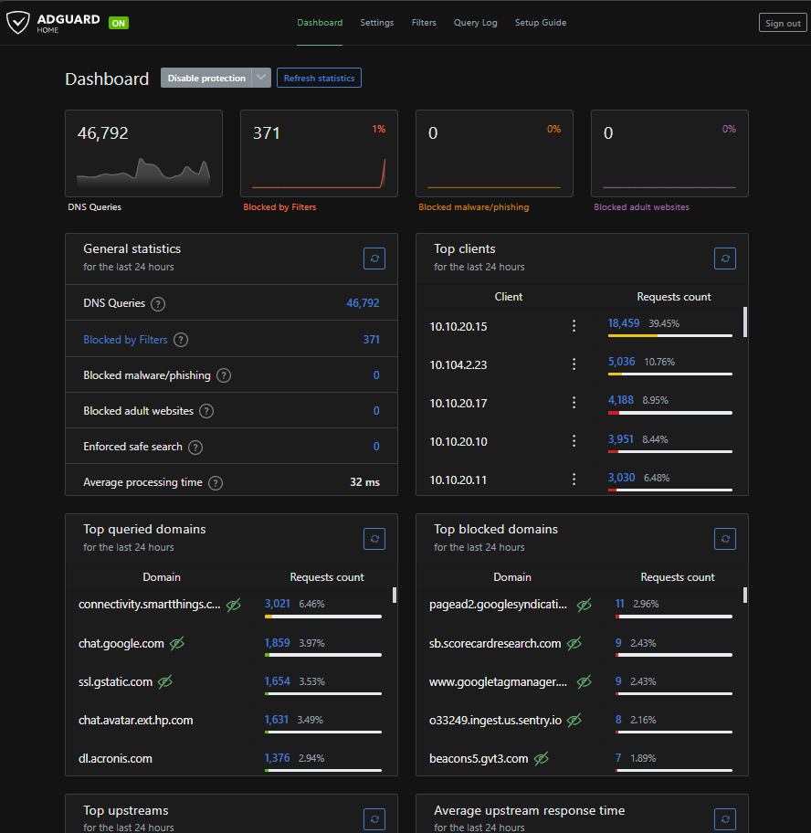
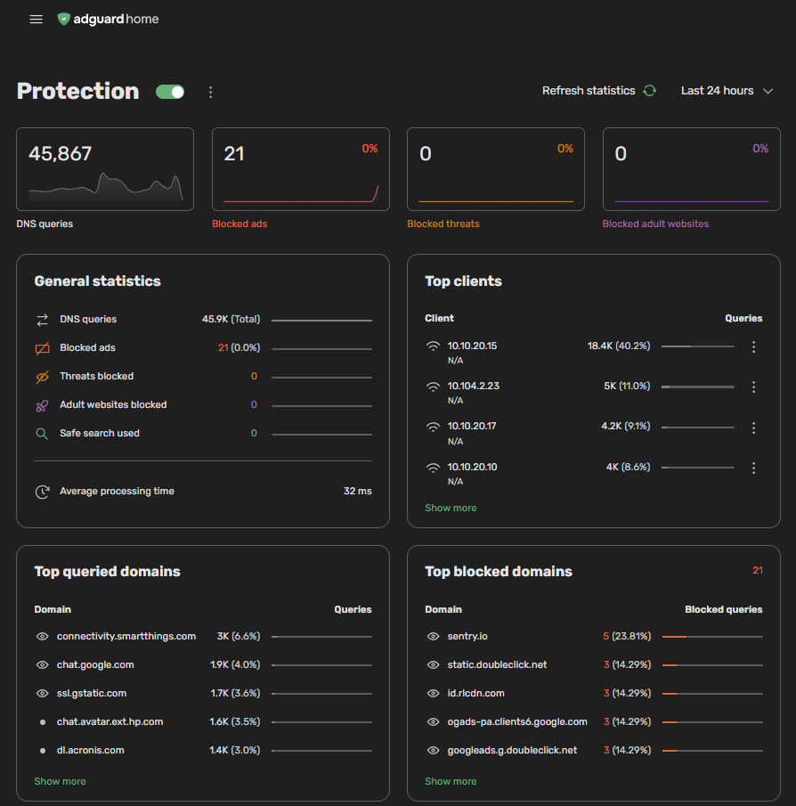

# AdGuard Home v1.0 Beta Migration

## Overview

I upgraded my AdGuard Home instance from `v0.107.79` to `v1.0.0-b.1` on a Debian LXC running under Proxmox.

The goal was to test the new AdGuard Home 1.0 beta while preserving the existing DNS configuration, filtering rules, statistics, client history, and administrative settings.

Because AdGuard Home provides DNS for the network, I treated the upgrade as a critical infrastructure change and created rollback options before making changes.

---

## Dashboard Comparison

<table>
  <tr>
    <th>Before — AdGuard Home v0.107.79</th>
    <th>After — AdGuard Home v1.0.0-b.1</th>
  </tr>
  <tr>
    <td align="center">
      
    </td>
    <td align="center">
      
    </td>
  </tr>
  <tr>
    <td align="center">
      <em>Original v0.107.79 dashboard.</em>
    </td>
    <td align="center">
      <em>New v1.0.0-b.1 dashboard with the existing configuration and history preserved.</em>
    </td>
  </tr>
</table>

---

## Environment

- Proxmox VE
- Debian LXC
- AdGuard Home
- Installation path: `/opt/AdGuardHome`

---

## Pre-Upgrade Preparation

Before beginning the upgrade, I created a Proxmox snapshot of the AdGuard Home LXC.

```bash
sudo pct snapshot 101 pre-adguard-beta \
  --description "Before AdGuard Home 1.0 beta"
```

I verified the snapshot:

```bash
sudo pct listsnapshot 101
```

Output:

```text
`-> pre-adguard-beta            2026-10-06 23:12:54     Before AdGuard Home 1.0 beta
 `-> current                                            You are here!
```

I also confirmed the existing AdGuard Home version:

```bash
sudo /opt/AdGuardHome/AdGuardHome --version
```

Output:

```text
AdGuard Home, version v0.107.79
```

The existing installation was located at:

```text
/opt/AdGuardHome
```

with the primary configuration file at:

```text
/opt/AdGuardHome/AdGuardHome.yaml
```

---

## Initial Upgrade Attempt

My first attempt used the AdGuard Home installation script to switch the installation to the beta channel.

```bash
curl -s -S -L \
  https://raw.githubusercontent.com/AdguardTeam/AdGuardHome/master/scripts/install.sh \
  | sh -s -- -c beta -r -v
```

The `-r` option tells the installer to reinstall an existing installation.

During the process, the installer stopped and removed the existing AdGuard Home service before downloading the beta release.

The first attempt also failed during the download because the shell was running from inside:

```text
/opt/AdGuardHome
```

The reinstall process removed that directory before attempting to save the downloaded archive.

This resulted in:

```text
curl: (23) client returned ERROR on write
```

At this point:

- `/opt/AdGuardHome` had been removed
- the AdGuard Home systemd service no longer existed
- DNS service was unavailable

---

## Recovery Using Proxmox Snapshot

Because the LXC had been snapshotted before the upgrade, I was able to roll the entire container back quickly.

From the Proxmox host:

```bash
sudo pct rollback 101 pre-adguard-beta
```

After restarting the container, I verified that the original version and service were restored.

```bash
sudo /opt/AdGuardHome/AdGuardHome --version
```

Output:

```text
AdGuard Home, version v0.107.79
```

I also verified the service:

```bash
sudo systemctl status AdGuardHome --no-pager
```

The AdGuard Home service was active again and DNS functionality was restored.

This confirmed that the Proxmox snapshot provided a clean rollback path.

---

## Second Upgrade Attempt

I retried the beta installer from `/tmp` instead of from within the application directory.

```bash
cd /tmp
```

I then ran:

```bash
curl -s -S -L \
  https://raw.githubusercontent.com/AdguardTeam/AdGuardHome/master/scripts/install.sh \
  | sh -s -- -c beta -r -v
```

This time the beta installed successfully.

The installed version was:

```bash
/opt/AdGuardHome/AdGuardHome --version
```

Output:

```text
AdGuard Home, version v1.0.0-b.1
```

However, the new instance started as if it were a fresh installation.

Symptoms included:

- the web interface requested creation of a new administrator account
- DNS on port 53 was not responding
- `AdGuardHome.yaml` was missing
- the previous configuration was not loaded

At this point I determined that using the reinstall process was not appropriate for preserving the existing configuration.

---

## Second Rollback

I rolled the LXC back to the same Proxmox snapshot again.

After rollback, the original installation was restored again:

This time I chose a different upgrade method.

---

## Successful Upgrade Method

Instead of reinstalling AdGuard Home, I manually downloaded the beta release and replaced only the application binary.

This allowed the existing configuration and application data to remain untouched.

### Download the Beta Release

From inside the AdGuard Home LXC:

```bash
cd /tmp
```

Download the beta package:

```bash
curl -L \
  https://static.adtidy.org/adguardhome/beta/AdGuardHome_linux_amd64.tar.gz \
  -o AdGuardHome_linux_amd64.tar.gz
```

Extract it:

```bash
tar -xzf AdGuardHome_linux_amd64.tar.gz
```

Verify the downloaded version before changing the running installation:

```bash
/tmp/AdGuardHome/AdGuardHome --version
```

Output:

```text
AdGuard Home, version v1.0.0-b.1
```

---

## Replace Only the AdGuard Home Binary

Stop the existing service:

```bash
systemctl stop AdGuardHome
```

Replace only the executable:

```bash
cp /tmp/AdGuardHome/AdGuardHome \
  /opt/AdGuardHome/AdGuardHome
```

Restore executable permissions:

```bash
chmod 755 /opt/AdGuardHome/AdGuardHome
```

Start the service:

```bash
systemctl start AdGuardHome
```

The existing configuration files and data directories were intentionally left unchanged.

---

## Validation

### Verify the New Version

```bash
/opt/AdGuardHome/AdGuardHome --version
```

Output:

```text
AdGuard Home, version v1.0.0-b.1
```

### Verify the Service

```bash
systemctl status AdGuardHome --no-pager
```

The service started successfully and showed DNS listeners on port 53.

### Verify DNS Resolution

DNS queries were tested directly against the AdGuard Home server:

```bash
dig @10.104.2.21 google.com
```

DNS resolution completed successfully.

### Verify Existing Filtering Configuration

I checked several important values in the existing configuration file:

```bash
grep -nE \
  'filtering_enabled|protection_enabled|filters_update_interval' \
  /opt/AdGuardHome/AdGuardHome.yaml
```

Output:

```text
184:  filters_update_interval: 24
186:  filtering_enabled: true
190:  protection_enabled: true
```

This confirmed that the original configuration had been retained.

---

## Configuration Migration Results

After the binary-only upgrade, AdGuard Home v1.0 beta successfully loaded the existing configuration.

The migrated installation retained:

- existing administrator account
- DNS configuration
- filtering settings
- blocklists
- historical query data
- client statistics
- client identification
- protection settings
- previous dashboard statistics

The new v1.0 interface displayed the existing historical data immediately after the upgrade.

---

## Dashboard Comparison

<table>
  <tr>
    <th>Before — AdGuard Home v0.107.79</th>
    <th>After — AdGuard Home v1.0.0-b.1</th>
  </tr>
  <tr>
    <td align="center">
      
    </td>
    <td align="center">
      
    </td>
  </tr>
  <tr>
    <td align="center">
      <em>Original v0.107.79 dashboard.</em>
    </td>
    <td align="center">
      <em>New v1.0.0-b.1 dashboard with the existing configuration preserved.</em>
    </td>
  </tr>
</table>
---

## Lessons Learned

### Create a Hypervisor-Level Rollback Point

The Proxmox snapshot was the most important protection during this upgrade.

When the first two attempts caused problems, the entire DNS server could be restored quickly without manually rebuilding the application.

### Do Not Store Backups Inside an Application Directory Being Replaced

I initially created an application-level backup inside:

```text
/opt/AdGuardHome
```

Because the reinstall process removed that directory, the backup was removed along with it.

Application backups should instead be stored somewhere outside the application directory, such as:

```text
/root/agh-backup
```

or on external backup storage.

### Understand What a Reinstall Script Actually Does

The beta installation script with the reinstall option did more than replace the binary.

It removed the existing installation before installing the beta release.

For an application containing important configuration and state, understanding that behavior before running the installer is important.

### Binary Replacement Was the Safer Migration Method

For this upgrade, replacing only the AdGuard Home executable allowed the existing configuration to remain intact.

The process became:

```text
Download new release
        ↓
Verify binary
        ↓
Stop service
        ↓
Replace executable
        ↓
Start service
        ↓
Validate DNS
        ↓
Validate configuration
```

This was much less disruptive than reinstalling the entire application.

### Validate the Service, Not Just the Web Interface

After an infrastructure upgrade, confirming that the web interface loads is not enough.

I validated DNS directly using:

```bash
dig @10.104.2.21 google.com
```

I also checked the systemd service and configuration file.

This confirmed that the actual network service was functioning, not just the management interface.

---

## Final Result

AdGuard Home is now running:

```text
v1.0.0-b.1
```

on the existing Debian LXC with the original configuration and historical data successfully preserved.

The Proxmox snapshot will remain temporarily while the beta release is evaluated for stability.

---

## Key Takeaway

The most valuable part of this upgrade was not simply installing a newer version.

The process involved:

```text
Backup
   ↓
Upgrade attempt
   ↓
Failure
   ↓
Diagnosis
   ↓
Rollback
   ↓
Revised migration strategy
   ↓
Upgrade
   ↓
Validation
```

Having a tested rollback path turned what could have been a DNS outage and rebuild into a controlled infrastructure change.
