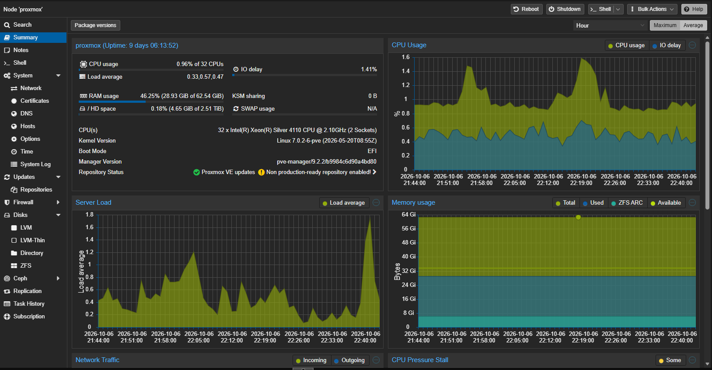

# Era 7 — Moving to Virtualized Infrastructure

**HPE ProLiant · Proxmox VE · ZFS · KVM/QEMU · LXC**

## A new platform
I acquired a used HPE ProLiant server with an existing Windows-based environment. After reviewing the installation and licensing requirements, I decided that recovering that environment was not a practical long-term approach.

Instead, I researched virtualization platforms, wiped the old installation, and installed Proxmox VE.

  

## What changed
Rather than moving one crowded Ubuntu server onto more powerful hardware, I separated services into purpose-built virtual machines and LXC containers.

- AdGuard Home and Beszel moved into dedicated service containers.
- Home Assistant runs as its own virtual machine.
- Tailscale routing has a dedicated container.
- Dragonwilds runs in a Linux VM with Docker.
- ZFS storage, backups, and resource allocation became part of the platform design.

## Skills Applied & Developed
- **Applied:** IP networking, Linux troubleshooting, infrastructure planning, and service migration.
- **Developed and expanded:** Proxmox VE administration, KVM/QEMU virtual machines, LXC containers, ZFS, workload isolation, virtual resource allocation, and VM/container backup planning.

## Why the lab grew
Virtualization made the environment easier to organize, but operating several independent systems made monitoring, maintenance, and recovery more important.

**Previous:** [Era 6 — Bringing Enterprise Networking Home](06-enterprise-networking.md)  
**Next:** [Era 8 — Operating Infrastructure →](08-operations.md)

[← Evolution index](README.md)
