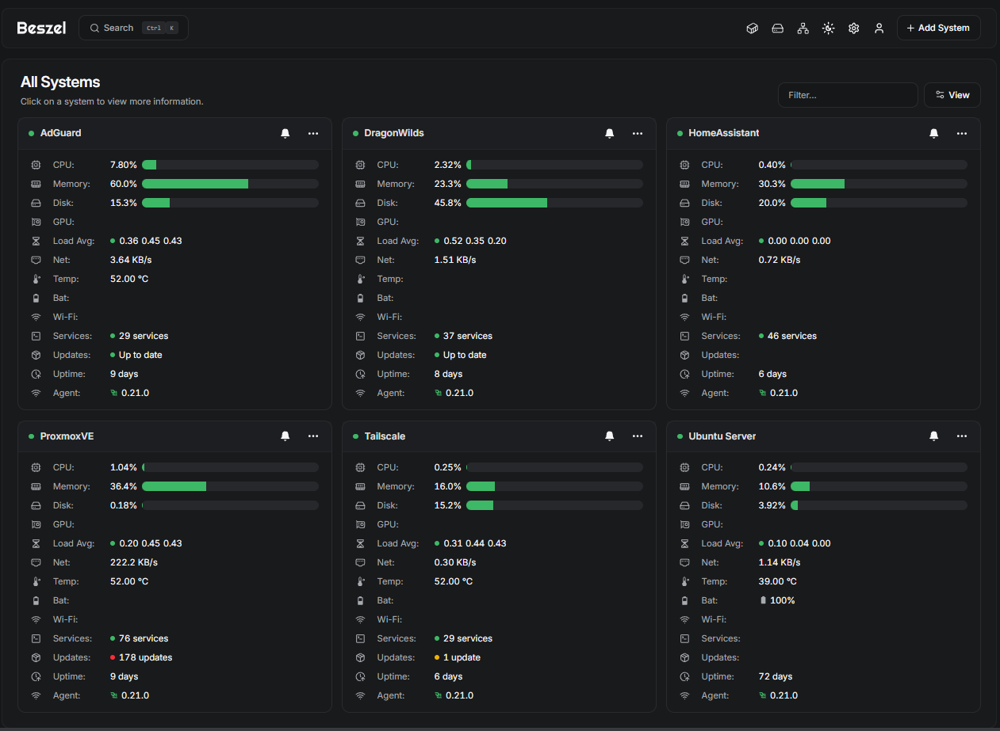

# Era 8 of 9 — Operating Infrastructure

**Monitoring · Backups · Remote access · Automation**

## From running services to operating them
With the environment virtualized, the question changed from **“How do I get this running?”** to **“How do I know it is healthy, maintain it, secure it, and recover it?”**

## What changed
- **Beszel** provides a central view of system resources and service health.
- **Healthchecks.io** provides external checks for critical systems.
- **Tailscale** provides remote access without exposing management interfaces directly to the public internet.
- SSH, dedicated service accounts, Bash scripts, and Home Assistant controls help with administration and routine tasks.
- Scheduled backups and recovery planning became part of operating the lab.

  

## What I learned
**Monitoring · Observability · Backup and recovery · Secure remote access · SSH administration · Scripting · Service management**

## Why the lab grew
Once core systems were easier to observe and manage, I could focus more on local control, smart-home services, segmentation, and automation.

**Previous:** [Era 7 — Moving to Virtualized Infrastructure](07-proxmox.md)  
**Next:** [Era 9 — Local Control, Segmentation, and Automation →](09-local-control.md)

[← Evolution index](README.md)
