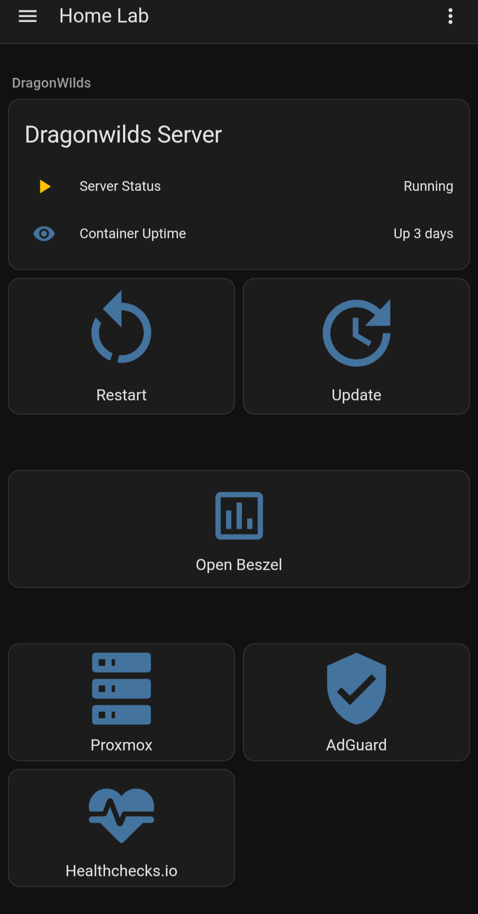

# Era 9 of 9 — Local Control, Segmentation, and Automation

**Home Assistant · IoT · Local-first design · Future improvements**

## The current phase
This era is an evolving record of where I want to take the homelab next, not a claim that every planned improvement has already been implemented.

My priorities include reducing unnecessary cloud dependencies, improving separation between trusted clients and IoT devices, and making everyday management easier.

  

## What is already in place
Home Assistant now provides a custom dashboard with server status and uptime, controlled maintenance actions for Dragonwilds, and links to services such as Proxmox, AdGuard Home, Beszel, and external health monitoring.

## What I am exploring
- Separating trusted clients, servers, management devices, and IoT equipment while preserving needed communication.
- Bringing more smart-home devices under local Home Assistant control.
- Evaluating Matter, Zigbee, and Z-Wave integrations and the hardware they require.
- Improving least-privilege access, monitoring, recovery, and maintenance workflows.

## Skills Applied & Developed
- **Applied:** Network segmentation design, firewall troubleshooting, service administration, and security principles.
- **Expanding and exploring:** Home Assistant integrations, local-first smart-home architecture, cross-VLAN device communication, and practical automation.

## Smaller improvements
As the lab evolves, I want to document meaningful changes as focused project notes rather than create a new era for every upgrade.

- [AdGuard Home 1.0 beta upgrade](../adguardHome-1.0%20beta%20upgrade.md) — an example of a smaller change with its own technical write-up.

> 📷 **Image placeholder:** Future sanitized topology showing planned client, server, and IoT network separation.

## The journey so far
A repurposed laptop running Pi-hole grew into a platform for networking, Linux, self-hosting, virtualization, monitoring, and automation. Some projects taught me new technologies; others gave me a place to apply and strengthen skills from my professional work.

**Previous:** [Era 8 — Operating Infrastructure](08-operations.md)

[← Evolution index](README.md)
